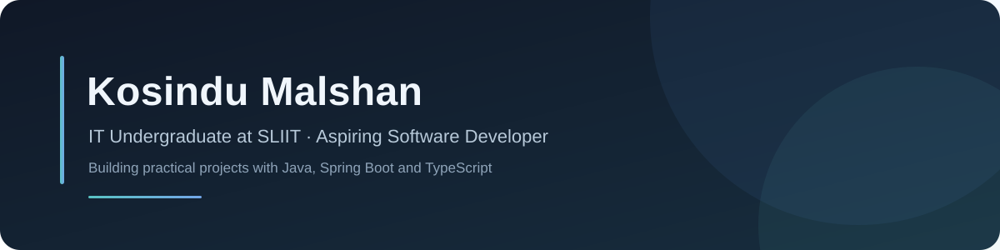
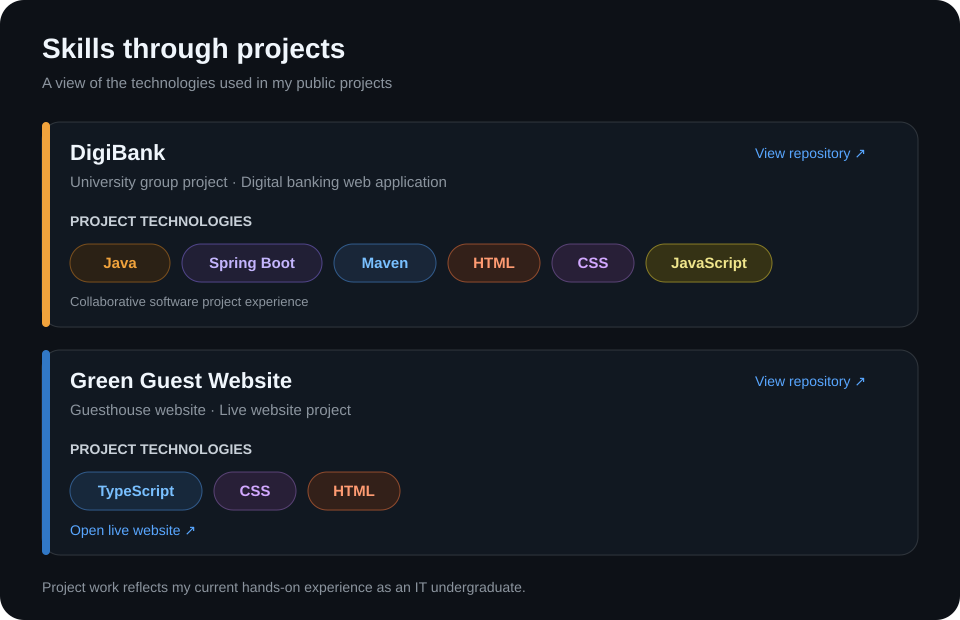

  

  
  
  

## About

I’m an IT undergraduate at **SLIIT** and an aspiring software developer, currently training as a **Medical Laboratory Technologist in Microbiology**. I’m building hands-on experience through university and web development projects, and growing my software development skills through practical work.

## Technologies

  
  
  
  
  

## Selected projects

| Project | What it is | Technologies |
| --- | --- | --- |
| [DigiBank](https://github.com/kosindum-code/digibank_db) | University group project building a digital banking web application module by module. | Java 21 · Spring Boot · Maven |
| [Green Guest Website](https://github.com/kosindum-code/green-guest-website) | Guesthouse website with a [live demo](https://cozy-rugelach-3438d6.netlify.app/). | TypeScript · CSS · HTML |

## Skills in practice

The map connects technologies to the projects where they appear. It represents project experience, not a formal proficiency rating.

  

## 📊 General Stats

<table>
  <tr>
    <td width="38%" valign="top">
      
    </td>
    <td width="62%" valign="top">
      
    </td>
  </tr>
</table>

---

Learning through study, collaboration, and building practical projects.

